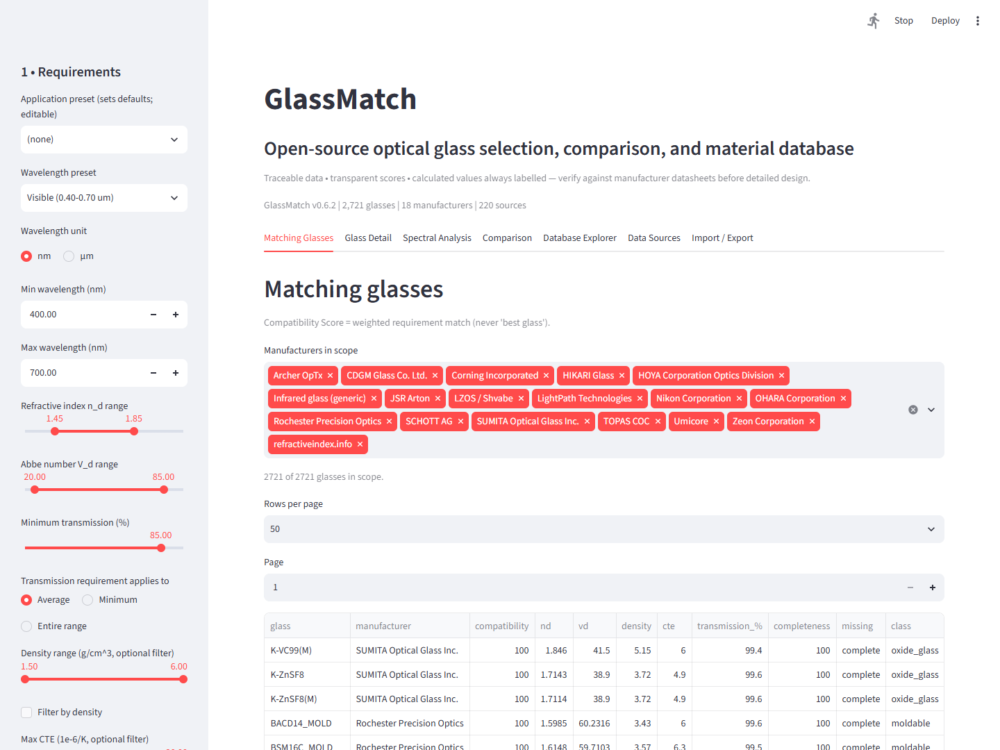
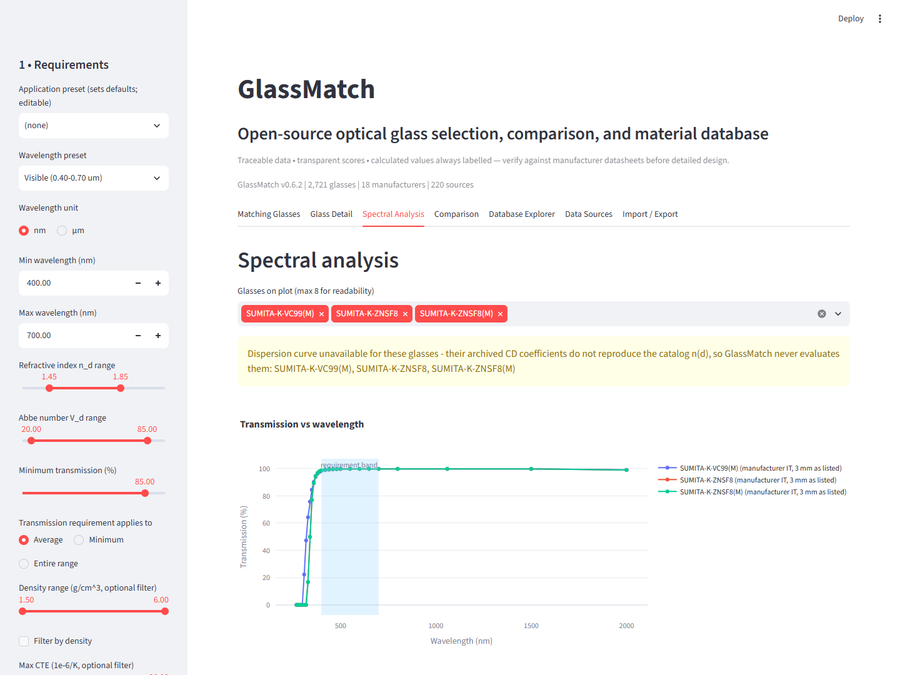
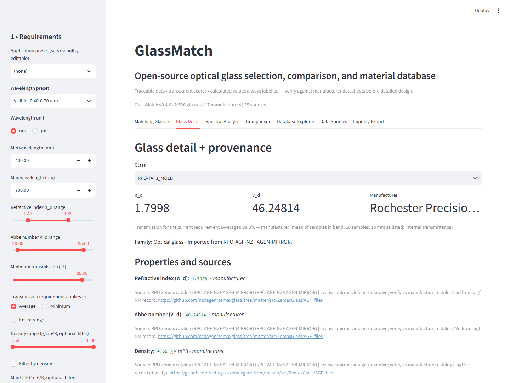
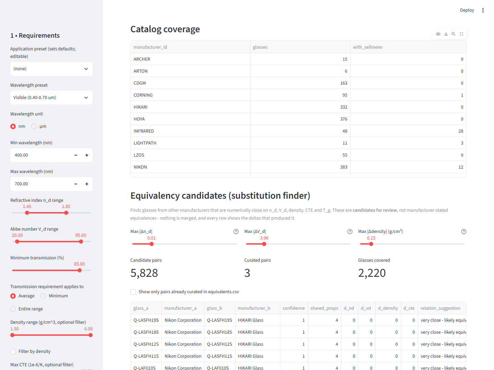
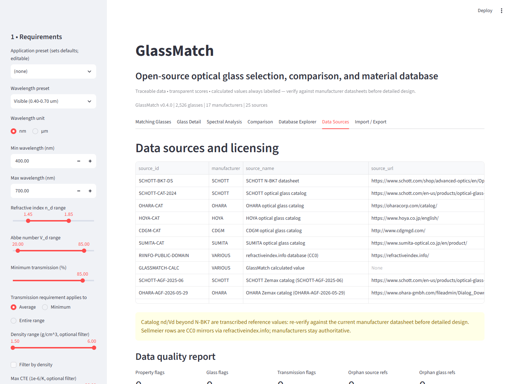

# GlassMatch

[](https://github.com/br24563/Glass-Match/actions/workflows/ci.yml)
[](https://www.python.org/downloads/)
[](LICENSE)

Open-source optical glass selection, comparison, and material database.
**2,721 materials · 18 source collections · 220 traceable sources** — search,
rank, compare, and inspect provenance for oxide glasses, crystals, IR
materials, polymers, and moldables.







> Screenshots captured from a live run (`start.bat`); regenerate with
> `python scripts/capture_screenshots.py` (needs `pip install playwright` and a
> local Microsoft Edge install).

## Features

- Requirement-driven matching (wavelength band, n_d, V_d, transmission,
  density, CTE) with transparent Compatibility Scores and user-adjustable weights.
  Maker-scoped, paginated results scale to thousands of glasses.
- **Transmission modes**: Average / Minimum / Entire range, evaluated against
  manufacturer IT rows (64k samples) with Fresnel fallback labelled as
  calculated; Entire range refuses to score when band coverage < 90%.
  Conflicting duplicate samples are excluded (never pick-a-winner) and disclosed.
- **Data quality report**: range checks, duplicate detection, missing-source
  checks and orphan source references — flags are listed for review, never
  auto-fixed.
- **IR mode**: for chalcogenide/IR glasses (no meaningful V_d), matching scores
  n_d + transmission band instead of penalizing the missing Abbe number.
- Provenance-first database: every value carries source, license, and
  data_type (manufacturer / calculated / interpolated / user_imported).
- **Cross-manufacturer substitution finder**: computes candidate equivalents
  from n_d, V_d, density, CTE and T_g with adjustable tolerances. Candidates are
  flagged for review and never auto-merged; curated (source-backed) pairs are
  shown separately and are never overwritten.
- Interactive Plotly dispersion + transmission plots (calculated curves labelled).
  Dispersion is drawn **only** where the archived coefficients reproduce the
  catalog n_d at 587.6 nm (710 glasses; 1- through 5-term fits are all
  evaluated, including refractiveindex.info `formula 2`, whose C coefficients
  are already in um² and must not be squared). The other 1,872 rows are
  series/polynomial forms that
  fail that check — they are stored verbatim and **never** evaluated, and the
  UI says so on the glass page.
- **Crystal materials** — 195 pages covering CaF₂, MgF₂, BaF₂, SrF₂, LiF, LaF₃,
  sapphire, fused silica/quartz, spinel, YAG, ZnSe, ZnS, Ge, Si, CdTe, GaAs and
  Te, from [refractiveindex.info](https://refractiveindex.info) (public domain,
  **CC0 1.0**, so unlike the manufacturer catalogs it ships with the repo). Each
  cites the paper it came from. Crystals have no n_d/V_d, so the detail page
  gives you a **reference-wavelength control** and tells you whether the number
  is a source measurement, an interpolation between samples, or an evaluation
  of a published dispersion fit — and says "unavailable" rather than
  extrapolating when the request falls outside the range the source states.
- Glass detail pages, 2-5 glass comparison, database + source explorers
  (material-class filter, obsolete toggle, per-maker coverage table).
- User CSV + manufacturer `.agf` import with validation; CSV/JSON export
  with provenance preserved.
## Installation

**Easiest (Windows):** double-click `start.bat`. First run creates an isolated
`.venv` and installs dependencies (uses `uv` if available, ~1 s, else pip);
every run after that just opens the app at `http://localhost:8501`.

**Manual:**

```text
git clone <repo-url> GlassMatch
cd GlassMatch
pip install -r requirements.txt
streamlit run app.py
```

Works offline once installed; no servers, keys, or cloud services.

## Running tests

```text
pip install -r requirements-dev.txt
python -m pytest tests -q
```

The matching algorithm and database layer are tested without Streamlit;
`streamlit.testing.v1.AppTest` exercises the full app script end-to-end.

## Example workflow

1. Pick the Visible preset (0.40-0.70 um), set n_d 1.45-1.60 and V_d 55-75
   for a low-dispersion crown search.
2. Weight transmission 35%, V_d 25%, n_d 25%.
3. Scope makers (e.g. SCHOTT + OHARA), page through ranked Compatibility
   Scores — N-BK7-class glasses surface at top.
4. Open Glass Detail to check the SCHOTT source row before designing.
5. For MWIR (3-5 um): pick the MWIR preset — chalcogenide/IR glasses are
   scored on n_d + transmission band (V_d skipped, shown as n/a).

## Matching algorithm

Per-property score is 1.0 inside the required band with linear falloff
outside. Overall = weighted mean over available data x (0.5 + 0.5 x covered
weight). Missing data lowers completeness instead of silently failing,
unless Require available data is on. Weights auto-normalize to 100%.

**IR mode** (`material_class=chalcogenide` or maker INFRARED/LIGHTPATH/UMICORE):
V_d is physically meaningless, so its weight is redistributed to n_d and
transmission and the glass is never penalized for the missing value.

Transmission requirement modes: **Average** = mean of manufacturer samples in
band; **Minimum** = worst sample; **Entire range** = worst sample but only
when samples span ≥90% of the band (otherwise reported missing, not guessed).
Manufacturer IT rows are preferred; a calculated Fresnel estimate is used only
for glasses with no manufacturer rows and is always labelled calculated.

## Database architecture

- `manufacturers.csv`, `glasses.csv`, `properties.csv` (long format with
  source_id + data_type), `sources.csv`, `sellmeier.csv` (+`transmission.csv`,
  `equivalents.csv`).
- `material_class` ∈ {oxide_glass, crystal, chalcogenide, polymer, moldable},
  `status` ∈ {standard, obsolete}; both default safely on legacy files.
- `spectral_nk.csv` holds tabulated optical constants (wavelength, n, k) for
  crystal pages, verbatim with a per-row `source_id`.
- Dispersion gate: a `formula` beginning `Sellmeier` means plottable; the
  importer earns that label only by reproducing the catalog n_d within 0.002.
  Everything else is stored verbatim as `Non-dispersable (...) - archived,
  never evaluated`, with the measured discrepancy in the label.
- Add a manufacturer: append rows to `manufacturers.csv`/`sources.csv`,
  then glasses + properties — or run `scripts/merge_agf.py` on a staged `.agf`.
  No matching/UI code changes.
- Add a glass: append one `glasses.csv` row + N `properties.csv` rows.

See **[CONTRIBUTING.md](CONTRIBUTING.md)** for the full workflow, including how to
add a manufacturer without writing any Python. Release history is in
**[CHANGELOG.md](CHANGELOG.md)**.

## Database contents (committed, 2026-09)

| Maker file | Glasses | Notes |
|---|---|---|
| SCHOTT June-2025 `.agf` | 366 | Authoritative, current |
| OHARA May-2026 `.agf` | 433 | Authoritative, current; 188 Herzberger legacy rows archived |
| HOYA / NIKON / HIKARI / SUMITA / CDGM / LZOS / Corning | 1,657 | nzhagen/zemaxglass mirror, vintage unknown — verify before design |
| IR (generic/LightPath/Umicore) | 61 | Chalcogenide + crystal entries; IR mode applies |
| Polymers (Zeon/Arton/Topas/Archer) + RPO moldables | 70 | Polymer/moldable classes |
| **Total** | **2,721** | 710 verified Sellmeier curves · 1,872 archived non-dispersable · 139 with no curve · 195 CC0 crystal pages · 64k transmission rows · 135k tabulated n/k samples |

Duplicate NM names across mold variants (HOYA E-FL6/FD-series, Nikon E-series)
are disambiguated with status-flag suffixes — zero duplicate `glass_id`s.

## Data sources and licensing

- SCHOTT/OHARA `.agf` files: authoritative, redistribution-limited — bulk files
  stay in untracked `data/staging/`; only normalized rows ship.
- Mirror `.agf` files: `mirror-vintage-unknown; verify vs manufacturer catalog`.
- N-BK7 anchor values: SCHOTT datasheet (verify at schott.com).
- No scraping behind access controls.

**Crystals and tabulated optical constants are a different case.** The 195
crystal pages under `data/spectral/refractiveindex_info/` come from the
[refractiveindex.info](https://refractiveindex.info) database, which its
maintainer placed in the **public domain under CC0 1.0** ("you may copy,
modify, and distribute ... even for commercial purposes, without asking
permission"). Those files are therefore *committed here* — they are the
provenance for every crystal number, and the licence permits it. Each page
records the paper it was taken from, and GlassMatch carries that citation
through to `sources.csv` (e.g. CaF2 n_d <- Malitson, *Appl. Opt.* **2**, 1103
(1963), DOI `10.1364/AO.2.001103`). The underlying papers remain the property of
their authors; GlassMatch redistributes the compiled constants, not the
publications. Refresh with `python scripts/fetch_refractiveindex.py`, which
pins a manifest with a SHA-256 per file.

## Data integrity

data_type is always shown: manufacturer-reported vs GlassMatch-calculated
(Sellmeier evaluation, Fresnel transmission estimate) vs interpolated vs
literature (a value read straight out of a cited table) vs user_imported.
Calculated values never pose as manufacturer data. Where no source covers a
requested wavelength or formula, GlassMatch reports the value as unavailable
rather than extrapolating one.

**Conflicting transmission samples are quarantined, not resolved.** Some source
catalogs list the same wavelength twice with different values - a data-entry
artifact (`1E-6` beside a real 0.99 reading) in some, a genuine disagreement in
others. GlassMatch does not pick a winner. Every such row is removed from
`transmission.csv` at import and recorded in
`data/normalized/transmission_conflicts.csv` with *both* values, the spread and
the source id, and is excluded from band statistics until a maintainer checks
the source catalog. The Data Sources tab reports how many are quarantined.

## Contributing / roadmap

Add rows + source metadata via PR (`scripts/merge_agf.py --only <SOURCE_ID>`
keeps merges idempotent); validation flags out-of-range values.
Done: bulk `.agf` import, non-Sellmeier gating, IR mode, dedup suffixes,
equivalency candidates, transmission conflict quarantine.
Future: achromatic-doublet finder, Zemax export, cost data, Sellmeier fitting.

## Expansion history

- Ring 1/2 engine: `glassmatch/importers/agf.py` parses user-downloaded Zemax
  `.agf` catalogs (NM/CD/TD/GC/IT/LD/ED records, UTF-16 fallback, multi-line
  polynomial CD, nd-vs-Sellmeier cross-check >0.002 flagged). Unknown records
  flagged, never crash.
- `glassmatch/importers/catalogs.py`: per-manufacturer download config —
  adding a maker = add an entry, not code.
- `data/manufacturers/<MFR>/README.md`: per-maker download instructions.
- 2026-09 merge: 17 staged `.agf` → 2,526 normalized glasses (see table above).
- 2026-09 merge: 195 refractiveindex.info pages (CC0 1.0) → crystal materials
  covering 17 compounds, the first non-glass material class.


